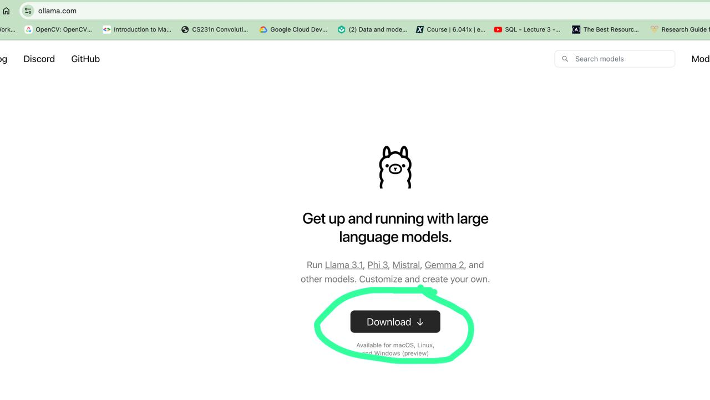

# This repo is to gentle introduction about the GenAI

Some of the People/Students are worry about the paid api keys to access the LLM
This blocking them to built the application.

The indentation of this repo is to address that problem by they can do at-least POC level as an experimentation. 

The solution is so simple following the method of running the tiny model in local by using the ollama and built the application.

## Begin to setup

1) As the first step we need to download the ollama cli, from their official website.

    https://ollama.com 

    


> **_Data Warning:_**   This will be around 500mb.

2) Then we have to pull any of the llm models into local, by running the following command.

> **_Data Warning:_**  Data Warning:llama will consume 4.7GB and gemma 5.5GB 

Try to run any one of the command is fine to pull, both are different models,
```
    ollama pull llama3.1
```
or
```
    ollama pull gemma2
```

> **_NOTE:_**  System should have atleast 8GB of RAM available to run the models.

If its less than that try with below, very tiny model

```
ollama pull gemma2:2b
```

> **_Data Warning:_** This one 1.6GB

3) After completion we can test using the command the model using the below command

```
    ollama run llama3.1
```

### Congrats thats it with setup, lets get into the code.